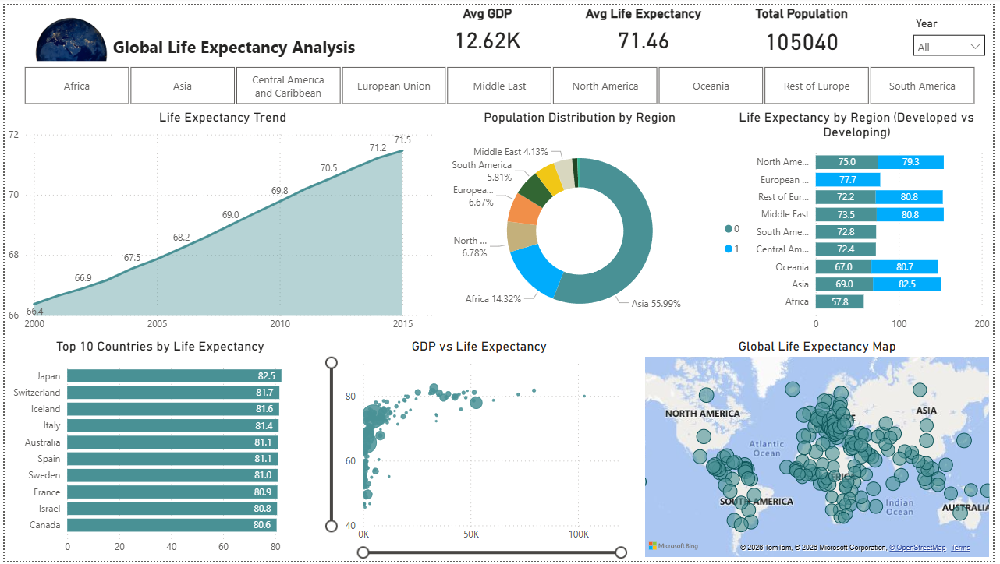

# global-life-expectancy-dashboard
Project Overview
This project explores global life expectancy using real-world health and economic data. The goal was to understand how factors like GDP, 
population, and regional differences influence life expectancy across countries.

Story Behind the Project

While learning data analytics, I wanted to work on a project that connects data with real-world impact. Life expectancy is one of the most important indicators of a country’s development, so I chose this dataset to uncover meaningful insights.

At first, the data was unstructured and difficult to interpret. I cleaned and transformed it, created a proper data model, and built key metrics to simplify the analysis. One challenge I faced was handling separate columns for developed and developing countries, which I solved by creating a unified category for better comparison.

Step by step, I transformed raw data into an interactive Power BI dashboard that tells a clear story through visuals.

📊 Key Insights
Life expectancy has steadily increased over the years
Developed regions generally have higher life expectancy
There is a strong positive relationship between GDP and life expectancy
Certain countries consistently rank among the top performers
Regional population distribution plays a key role in global trends

📈 Dashboard Features
KPI Cards: Avg Life Expectancy, Avg GDP, Total Population
Trend Analysis (Year-wise Life Expectancy)
Region-wise Population Distribution
Developed vs Developing Comparison
Top 10 Countries by Life Expectancy
GDP vs Life Expectancy (Scatter Analysis)
Global Map Visualization
Interactive Slicers (Year & Region)

🛠️ Tools & Skills Used
Power BI
Data Cleaning & Transformation
Data Modeling
DAX (Measures & Calculated Columns)
Data Visualization & Storytelling

📸 Dashboard Preview

